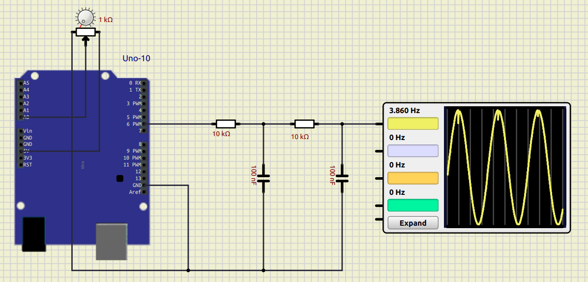

# Simple Arduino Sine Wave Generator

This project is a simple, variable-frequency sine wave generator built on the Arduino platform. It uses **Pulse-Width Modulation (PWM)** to produce a digital approximation of a sine wave, which is then smoothed into an analog signal using a passive **RC low-pass filter**.

The sine wave's frequency can be easily adjusted in real-time by turning a connected potentiometer (~3.9 Hz to ~78.1 Hz). This code is ideal for educational purposes or as a starting point for more complex signal generation projects.

### Hardware Requirements

To build and run this project, you will need the following components:

* **Arduino Board:** Any board with a PWM-capable pin (e.g. Arduino Uno R3).

* **Potentiometer:** A potentiometer to control the frequency.

* **Resistors:** Two 10 kOhm resistors for the RC filter.

* **Capacitors:** Two 100 nF capacitors for the RC filter.

* **Breadboard and Jumper Wires:** To connect all the components.

### Wiring Diagram

